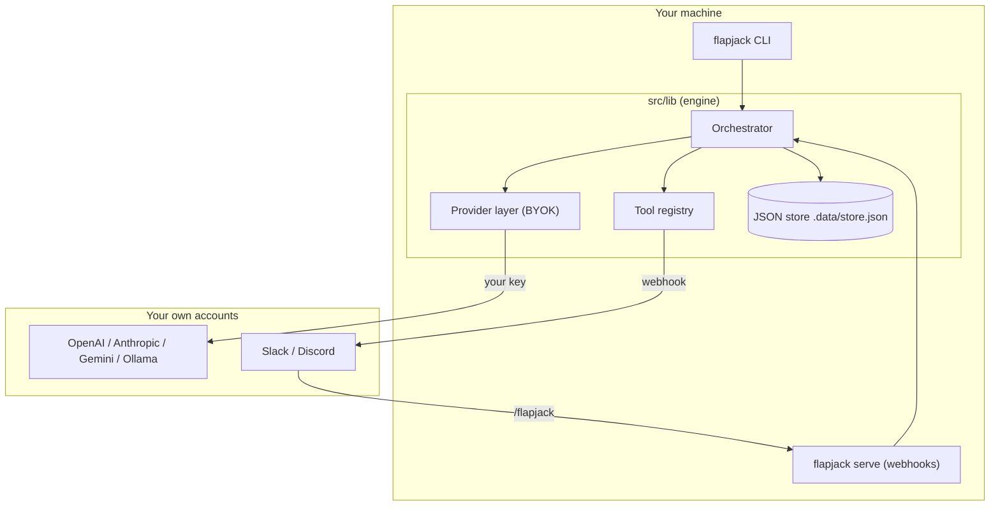
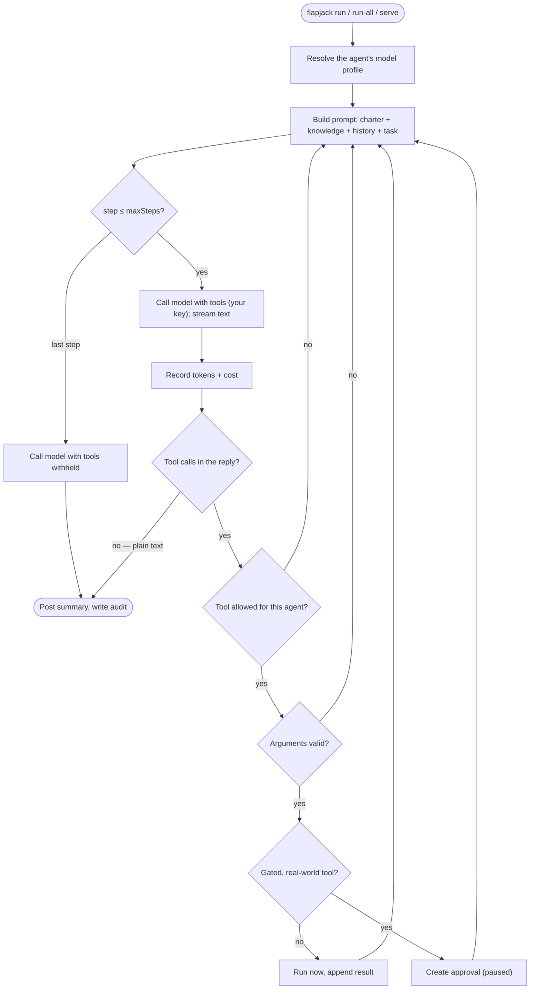
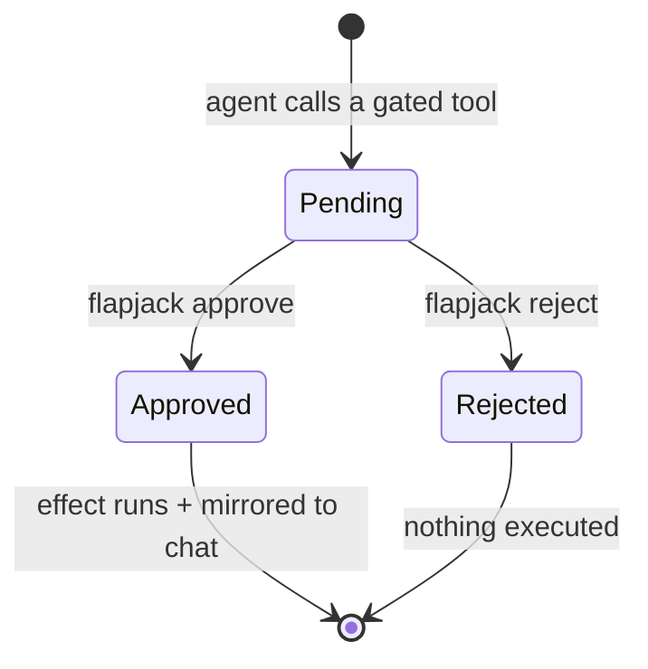
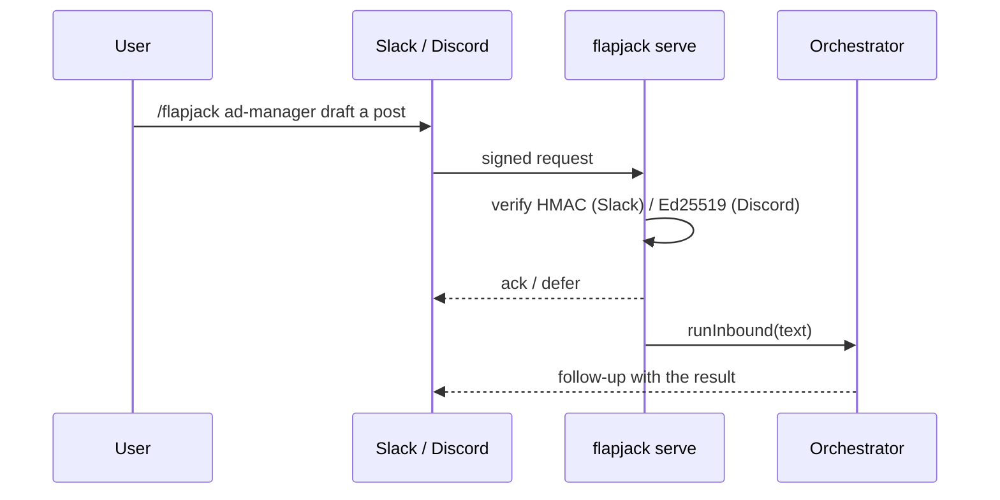

<div align="center">
  
  <h1>Flapjack</h1>
  <p><strong>An open-source AI agent org you run from the terminal — a mixture of models, your own keys, every agent a markdown file.</strong></p>
  <p>
    
    
    
    
  </p>
</div>

Flapjack is an open-source take on the idea behind [Pancake](https://getpancake.ai):
a stack of autonomous AI agents — organized like a company — that read, write, and
act through your tools. The difference: Flapjack is a **single CLI** you run on your
own machine, on your own API keys, with every agent defined in a markdown file you
control. No dashboard, no SaaS, no telemetry.

> Replace `your-org/flapjack` throughout with your repository once you publish.

## Demo

<div align="center">
  <a href="media/flapjack-promo.mp4">
    
  </a>
</div>

> ▶️ Auto-playing preview above (no sound — GitHub can't autoplay video).
> **[Watch the full 30-second video with sound →](media/flapjack-promo.mp4)**

**What the demo should show, in order:** `flapjack init` → `flapjack profile add`
→ `flapjack test` → `flapjack list` → `flapjack run` → a queued action in
`flapjack approvals` → `flapjack approve` → `flapjack costs` → `flapjack serve`
taking a `/flapjack` command from Slack.

## Why Flapjack

Three things a closed SaaS can't do:

1. **A mixture of models, not one vendor.** Configure many AI services at once —
   OpenAI, Anthropic, Gemini, Groq, OpenRouter, or a local Ollama — and assign a
   different one to each agent. Cheap local models on routine work, frontier models
   on the hard calls. No lock-in.
2. **Costs you can actually see.** Because it runs on your keys, `flapjack costs`
   reports exactly what every agent and model spent — tokens and dollars, per agent.
   Nothing hidden, nothing marked up.
3. **It lives in your terminal and your chat.** Drive the whole org from one CLI,
   then `flapjack serve` to take a `/flapjack` command in Slack and Discord.

Plus: agents are **markdown** you version in Git, real-world actions are gated
behind **human approval**, every run is written to a local **audit log**, and the
whole thing is **MIT-licensed** and self-hosted.

## Install

Requires **Node.js 18.18+** (Node 20+ recommended).

```bash
# Install the CLI globally, straight from GitHub (builds on install)
npm install -g github:your-org/flapjack

flapjack init        # scaffold agents/ + knowledge/ in the current folder
```

<details>
<summary>Or run it from a clone (with the example agents)</summary>

```bash
git clone https://github.com/your-org/flapjack
cd flapjack
npm install          # builds the CLI via the "prepare" script
npm link             # makes `flapjack` available on your PATH
# ...or skip the link and use:  npm run flapjack -- <command>
```

</details>

## Quickstart

```bash
# 1. Connect a model (Bring Your Own Key). Pick ONE:
flapjack profile add --name Default --provider openai    --model gpt-4o-mini            --key sk-...
flapjack profile add --name Local   --provider openai-compatible --model llama3.1:8b --base-url http://localhost:11434/v1

# 2. Verify it works
flapjack test

# 3. Put the org to work
flapjack list
flapjack run assistant "draft a launch tweet"
flapjack run-all
```

Keys are stored in a local `.data/store.json` (gitignored) and are never sent
anywhere except the provider you choose.

## Commands

| Command | What it does |
| ------- | ------------ |
| `flapjack init` | Scaffold `agents/` + `knowledge/` in this folder |
| `flapjack list` | List all agents (department, profile, autonomy, tools) |
| `flapjack run <agent> [task...]` | Run one agent, optionally on a one-off task |
| `flapjack run-all [department]` | Run every agent (optionally one department) |
| `flapjack approvals` | Show actions awaiting your approval |
| `flapjack approve <id>` / `reject <id>` | Decide a queued action (approve runs its effect) |
| `flapjack costs` | Token + dollar spend, by agent and by model |
| `flapjack audit [n]` | Show the last `n` log entries (default 20) |
| `flapjack config [set <k> <v>]` | Show or set `company` / `maxSteps` |
| `flapjack profiles` | List model profiles |
| `flapjack profile add \| rm \| default` | Manage BYOK model profiles |
| `flapjack connectors set` | Set Slack/Discord/inbound credentials |
| `flapjack test [profileId]` | Verify a model connection |
| `flapjack serve [--port 8787]` | Host the Slack/Discord/inbound webhooks |

### Bring your own key — many services at once

| Service | `--provider` | `--base-url` | Example `--model` |
| ------- | ------------ | ------------ | ----------------- |
| OpenAI | `openai` | *(default)* | `gpt-4o-mini` |
| Anthropic | `anthropic` | *(default)* | `claude-3-5-sonnet-latest` |
| Google Gemini | `gemini` | *(default)* | `gemini-1.5-flash` |
| OpenRouter | `openai-compatible` | `https://openrouter.ai/api/v1` | `anthropic/claude-3.5-sonnet` |
| Groq | `openai-compatible` | `https://api.groq.com/openai/v1` | `llama-3.3-70b-versatile` |
| Local Ollama | `openai-compatible` | `http://localhost:11434/v1` | `llama3.1:8b` |
| Local LM Studio | `openai-compatible` | `http://localhost:1234/v1` | *(your loaded model)* |

For local servers you don't need a real key. Use a model with solid
instruction-following — the agent loop expects clean JSON.

## Define an agent

Agents are markdown files with YAML frontmatter in `agents/`:

```markdown
---
name: Outbound SDR
department: Growth
emoji: 📨
role: Sales Development Rep
autonomy: approval        # suggest | approval | autonomous
profile: Smart            # which model profile to run on (optional)
channel: growth
tools: [web_search, save_note, post_message, send_email]
---

You book qualified demos. Research a prospect, draft a short, specific opener,
and request approval before any email goes out.
```

- **`autonomy: suggest`** — research & recommend only; can't call gated tools.
- **`autonomy: approval`** — can call gated tools, but they wait for `flapjack approve`.
- **`profile`** — the name of a model profile (mixture-of-models). Unknown/blank → default.
- **`tools`** — pick from the registry in [`src/lib/tools.ts`](src/lib/tools.ts):
  `post_message`, `save_note`, `read_notes`, `search_notes`, `web_search`,
  `fetch_url`, `delegate`, `send_email`, `send_invoice`, `publish_post`,
  `run_ad_campaign`, `deploy`, `reply_ticket` — plus any config tools you add.

Shared context for every agent lives in [`knowledge/`](knowledge) — edit
`knowledge/company.md` to teach them about your business.

> The external tools (email, invoicing, deploys, ads, social) ship as **simulated**
> effects so the app is safe out of the box. Wire them to real APIs in the tool's
> `effect()` in [`src/lib/tools.ts`](src/lib/tools.ts) — they stay behind the
> approval gate even after you do.

## Tools

Built-in tools live in [`src/lib/tools.ts`](src/lib/tools.ts). Beyond the basics:

- **`fetch_url`** — fetch the readable text of a public web page (HTTP GET, read-only).
  SSRF-guarded: it refuses private/loopback addresses (resolving DNS to check), caps the
  response at ~100 KB / 10 s, and strips HTML to text. Set `FLAPJACK_FETCH_ALLOW_PRIVATE=1`
  to allow private hosts on your own machine.
- **`search_notes`** — keyword search over saved notes (bounded results); pairs with
  `save_note` / `read_notes` for lightweight local memory.
- **`delegate`** — hand a subtask to another agent by id and get their summary back. Add
  `delegate` to an agent's `tools:` to enable it. Self-delegation, cycles (A→B→A), and
  runaway depth are all blocked (max depth 3); the sub-agent keeps its own autonomy/gating.

### Config-defined tools (no TypeScript)

Drop a JSON file in `tools/` to add a tool without editing code. The `webhook` kind POSTs
the call's arguments to a URL — gated, so it runs only after a human approves:

```json
// tools/notify.json
{ "id": "notify_team", "description": "Send a note to the ops webhook",
  "args": { "message": "the note" }, "required": ["message"],
  "kind": "webhook", "url": "https://hooks.example.com/...", "method": "POST" }
```

Invalid configs are skipped with a warning (never fatal) and can't override a built-in id.

## Native tool calling

Flapjack drives the agent loop with each provider's **native tool-calling API** (OpenAI
tool calls, Anthropic tool use, Gemini function calling) — no fragile "reply only in JSON"
prompting. Finishing is just the model replying in plain text (no tool call), and text
streams live in the terminal as it arrives.

For local/self-hosted models that don't support tool calling, put the profile in JSON mode:

```bash
flapjack profile add --name Local --provider openai-compatible \
  --model llama3.1:8b --base-url http://localhost:11434/v1 --tool-mode json
```

`--tool-mode native` (default) uses the real API; `json` falls back to a single parsed
JSON action per step.

## Machine-readable output

Add `--json` to `list`, `run`, `test`, `approvals`, and `costs` for structured output
(the human-readable format stays the default):

```bash
flapjack run assistant "draft a launch tweet" --json
# {"ok":true,"agentId":"assistant","steps":2,"summary":"…","error":null}
flapjack costs --json
```

## Slack and Discord

`flapjack serve` starts a small webhook server (no extra dependencies; signatures
are verified with Node's built-in crypto):

```bash
flapjack connectors set \
  --slack-webhook  https://hooks.slack.com/services/...   \
  --discord-webhook https://discord.com/api/webhooks/...  \
  --slack-secret   <slack-signing-secret>                 \
  --discord-key    <discord-app-public-key>               \
  --inbound-secret <a-shared-secret>

flapjack serve --port 8787
```

- **Outbound:** agent updates and approvals are mirrored to the webhook URLs.
- **Slack:** point a slash command at `https://<host>/slack`. Use
  `/flapjack ad-manager draft a LinkedIn ad`.
- **Discord:** set the Interactions Endpoint URL to `https://<host>/discord`.
- **Anything else:** `POST /inbound` with `{ "secret": "...", "text": "..." }`.

Expose your local server with a tunnel (cloudflared, ngrok) and point your app at
it. The first word of a message can name an agent; otherwise the Chief of Staff
takes it.

## Architecture

One CLI drives a small, provider-neutral engine. The browser part of this repo is
just the marketing landing page; the product is the CLI.



### How an agent run works

`flapjack run` builds a prompt from the agent's markdown + shared knowledge +
recent channel history, then runs a provider-neutral loop on the model's
**native tool calling**. Each step the model either calls one or more tools or
replies in plain text — a plain-text reply (no tool call) *is* the finish. On
the final step tools are withheld so the model must wrap up in text (no extra
call needed).



### Approval gating

Gated tools never run inside the loop — they create an approval and wait for a human.



### Inbound /flapjack command



## Project layout

```
agents/            # your org, as markdown files
knowledge/         # shared context every agent reads
public/brand/      # 5 logo options + a gallery (open /brand in the browser)
src/
  cli/index.ts     # the CLI — the product
  lib/
    orchestrator.ts# the ReAct agent loop (+ usage + chat mirror)
    llm.ts         # BYOK provider layer (OpenAI / Anthropic / Gemini / compatible)
    pricing.ts     # model price table for the cost meter
    agents.ts      # markdown agent loader
    tools.ts       # tool registry + approval gating
    approvals.ts   # approve/reject + run effects
    connectors.ts  # Slack/Discord outbound + signature verification
    inbound.ts     # parse + run /flapjack commands
    db.ts          # local JSON store (profiles, usage, connectors)
  app/             # marketing landing page (Next.js) — not the product
dist/              # compiled CLI (built by `npm run build`)
.data/store.json   # runtime data (gitignored)
```

The landing page is optional: `npm run site:dev` to preview, `npm run site:build`
to build it.

## Scheduling ("always on")

There's no in-process timer. Run the org on a schedule from cron / Task Scheduler
/ a GitHub Action:

```bash
flapjack run-all                 # the whole org
flapjack run-all Growth          # one department
```

## Security notes

- API keys live server-side in `.data/store.json` (gitignored, written `0o600` on POSIX)
  and are only ever sent to the provider you configured. They are stored **unencrypted** —
  keep that file private. `flapjack profile add` reminds you of this.
- `flapjack serve` **binds to `127.0.0.1` (loopback) by default.** Pass `--host 0.0.0.0`
  to expose it on the network (you'll get a warning), and `--rate-limit <n>` to cap requests
  per client (default 60 / 60 s).
- Inbound Slack/Discord requests are verified (HMAC / Ed25519); the generic `/inbound`
  endpoint requires a shared secret, compared in constant time.
- LLM tool arguments are validated before a tool runs or is queued, so a malformed gated
  payload never reaches the approval queue.
- LLM calls have a request timeout and retry transient failures (429/5xx) with bounded
  exponential backoff + jitter; deterministic errors (bad key, malformed request) are not
  retried.
- This is a local-first, single-user tool. If you expose `flapjack serve` publicly,
  put it behind a tunnel you trust and keep your secrets set.

## Reliability & data

- The JSON store is written atomically (temp file + rename) under a cross-process lock, so
  concurrent writers (e.g. `serve` plus a one-shot CLI command) don't clobber each other and
  a crash mid-write can't corrupt it. The store format is backward-compatible.
- The cost meter's price table is overridable: drop a `.data/pricing.json`
  (`[{ "match": "<model-id-substring>", "in": <usd/1M>, "out": <usd/1M> }]`) to add or
  correct prices. Unknown / local models stay at $0.
- Tests: `npm test` (zero extra dependencies — Node's built-in test runner) covers the
  tool loop, gating/approval, delegation guards, retries, the store, pricing, and
  `serve` security.

## Branding

Five logo options live in [`public/brand`](public/brand) — open
`http://localhost:3000/brand/` (during `npm run site:dev`) to compare them. Switch
the app-wide mark by changing the single `MARK` constant in
[`src/components/Logo.tsx`](src/components/Logo.tsx).

## License

[MIT](LICENSE). Not affiliated with Pancake.
