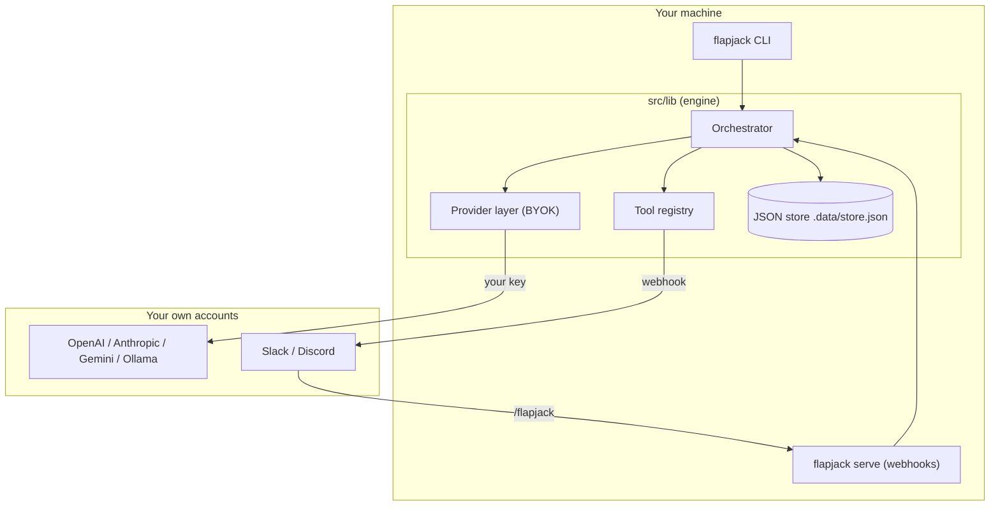

<div align="center">
  
  <h1>Flapjack</h1>
  <p><strong>Run an org of AI agents from your terminal — every agent a markdown file, on your own API keys, across any mix of model providers.</strong></p>
  <p>
    
    
    
  </p>
</div>

Flapjack is a **single CLI** that runs a company of autonomous AI agents on your own
machine. Each agent is a markdown file you keep in Git, the whole org runs on API keys
you control, and every real-world action waits for your approval. No dashboard, no SaaS
backend, no telemetry.

**Three things it does that a closed product can't:**

- **Mix any models you want.** Point each agent at a different provider — OpenAI,
  Anthropic, Gemini, or a local Ollama / LM Studio — so cheap local models handle
  routine work and frontier models take the hard calls. No lock-in.
- **Show you exactly what it costs.** Because it runs on your keys, `flapjack costs`
  reports real tokens and dollars, per agent and per model. Nothing hidden, nothing
  marked up.
- **Live where you work.** Drive the org from your terminal, then `flapjack serve` to
  take a `/flapjack` slash command in Slack or Discord.

Agents are version-controlled markdown, gated tools wait for human approval, and every
run lands in a local audit log. MIT-licensed and self-hosted end to end.

## Demo

<div align="center">
  <a href="media/flapjack-promo.mp4">
    
  </a>
</div>

<p align="center"><em>A 30-second tour: init the org → add a model → run an agent →
approve a queued action → check costs → serve a Slack command.
<a href="media/flapjack-promo.mp4">Watch with sound →</a></em></p>

## Install

Requires **Node.js 18.18+** (Node 20+ recommended).

<!-- maintainer: replace your-org/flapjack with the real repo slug before publishing -->

```bash
# Install the CLI globally, straight from GitHub (it builds on install)
npm install -g github:your-org/flapjack

# Scaffold a fresh org in the current folder (creates agents/ + knowledge/)
flapjack init
```

`flapjack init` writes one starter agent (`assistant`) and a `knowledge/company.md` into
an empty folder, so the Quickstart below works as-is.

<details>
<summary>Or run it from a clone (ships 7 example agents instead)</summary>

```bash
git clone https://github.com/your-org/flapjack
cd flapjack
npm install          # builds the CLI via the "prepare" script
npm link             # puts `flapjack` on your PATH
# ...or skip the link and prefix commands with:  npm run flapjack -- <command>
```

The clone already contains example agents (ad-manager, chief-of-staff, devops, …) rather
than the `assistant` starter, so run `flapjack list` to see them, then e.g.
`flapjack run ad-manager "draft a LinkedIn ad"`.

</details>

## Quickstart

```bash
# 1. Connect a model (Bring Your Own Key). Pick ONE:
flapjack profile add --name Default --provider openai --model gpt-4o-mini --key sk-...
flapjack profile add --name Local --provider openai-compatible --model llama3.1:8b --base-url http://localhost:11434/v1

# 2. Verify the connection
flapjack test

# 3. Put an agent to work
flapjack run assistant "draft a launch tweet"
```

Keys are stored in a local `.data/store.json` (gitignored) and are sent only to the
provider you choose — never anywhere else.

> **Heads up:** `flapjack run-all` runs *every* agent on your paid keys. Try a single
> `run` first; save `run-all` for a schedule (see [Scheduling](#scheduling)).

## What it looks like

`flapjack list` — your org at a glance, grouped by department:

```text
$ flapjack list
7 agents  (default profile: Default)

Briefing
  🥞  chief-of-staff @Smart  · Chief of Staff  suggest  [read_notes, save_note, post_message]

Engineering
  🛠️  devops  · DevOps & Reliability Engineer  approval  [read_notes, save_note, post_message, deploy]
  🔍  qa-tester @Local  · Quality Assurance Engineer  suggest  [web_search, read_notes, save_note, post_message]

Growth
  📈  ad-manager @Smart  · Performance Marketing Manager  approval  [web_search, read_notes, save_note, post_message, run_ad_campaign]
  ✍️  social-media-manager  · Social Media & Content Manager  approval  [web_search, read_notes, save_note, post_message, publish_post]

Operations
  💬  customer-support  · Customer Support Lead  approval  [web_search, read_notes, save_note, post_message, reply_ticket]
  🧾  invoicing  · Billing & Invoicing Specialist  approval  [read_notes, save_note, post_message, send_invoice]
```

`flapjack costs` — real spend on your own keys, broken down by agent and by model:

```text
$ flapjack costs
Total spend $0.0142   18 calls · 53,904 tokens (45,120 in / 8,784 out)

By agent
  Ad Manager          $0.0091   34,210 tok · 9 calls
  Chief of Staff      $0.0051   19,694 tok · 9 calls

By model
  gpt-4o-mini         $0.0142   openai · 18 calls
```

`flapjack approvals` — real-world actions queued for your sign-off:

```text
$ flapjack approvals
1 action awaiting approval:

  a_lm3k9xq2  📈 Ad Manager → Launch a LinkedIn campaign ($500/wk, SaaS founders)
      {"platform":"LinkedIn","budget":500,"audience":"SaaS founders"}

Approve with flapjack approve <id> or flapjack reject <id>
```

## Commands

| Command | What it does |
| ------- | ------------ |
| `flapjack help` | Show usage (also `-h` / `--help`, or run with no args) |
| `flapjack init` | Scaffold `agents/` + `knowledge/` in this folder |
| `flapjack list` *(alias `ls`)* | List all agents (department, profile, autonomy, tools) |
| `flapjack run <agent> [task...]` | Run one agent, optionally on a one-off task |
| `flapjack run-all [department]` | Run every agent (optionally one department) |
| `flapjack approvals` | Show actions awaiting your approval |
| `flapjack approve <id>` / `reject <id>` | Decide a queued action (approve runs its effect) |
| `flapjack costs` | Token + dollar spend, by agent and by model |
| `flapjack audit [n]` | Show the last `n` log entries (default 20) |
| `flapjack config [set <k> <v>]` | Show status (company, maxSteps, default profile, connectors — secrets masked) or set `company` / `maxSteps` |
| `flapjack profiles` | List model profiles |
| `flapjack profile add \| rm \| default` | Manage BYOK model profiles (you must keep at least one) |
| `flapjack connectors set` | Set Slack / Discord / inbound credentials |
| `flapjack test [profileId]` | Verify a model connection |
| `flapjack serve [--port] [--host] [--rate-limit]` | Host the Slack / Discord / inbound webhooks |

Add `--json` to `list`, `run`, `test`, `approvals`, and `costs` for machine-readable
output. Color follows the `NO_COLOR` convention and turns off automatically when output
isn't a TTY (piped or in CI). `maxSteps` — how many tool-use steps an agent may take per
run — is clamped to 1–20 (default 8).

### Bring your own key — many services at once

| Service | `--provider` | `--base-url` | Example `--model` |
| ------- | ------------ | ------------ | ----------------- |
| OpenAI | `openai` | *(default)* | `gpt-4o-mini` |
| Anthropic | `anthropic` | *(default)* | `claude-3-5-sonnet-latest` |
| Google Gemini | `gemini` | *(default)* | `gemini-1.5-flash` |
| OpenRouter | `openai-compatible` | `https://openrouter.ai/api/v1` | `anthropic/claude-3.5-sonnet` |
| Groq | `openai-compatible` | `https://api.groq.com/openai/v1` | `llama-3.3-70b-versatile` |
| Local Ollama | `openai-compatible` | `http://localhost:11434/v1` | `llama3.1:8b` |
| Local LM Studio | `openai-compatible` | `http://localhost:1234/v1` | *(your loaded model)* |

`flapjack profile add` flags: `--name` (required), `--provider`, `--model`, `--key`,
`--base-url`, `--id`, and `--tool-mode native|json` (see
[Native tool calling](#native-tool-calling)). For local servers you don't need a real
key — just pick a model with solid instruction-following.

**Seeding from the environment.** Configuration normally happens through the CLI, but on
a *fresh* store you can seed your first profile and connectors from env vars — copy
[`.env.example`](.env.example) to `.env.local` and set the `FLAPJACK_*` values.
`flapjack serve` also honors `PORT` and `FLAPJACK_HOST`.

## Define an agent

Agents are markdown files with YAML frontmatter in `agents/`:

```markdown
---
name: Outbound SDR
department: Growth
emoji: 📨
role: Sales Development Rep
autonomy: approval        # suggest | approval | autonomous
profile: Smart            # model profile to run on, by name or id (optional)
model: gpt-4o             # optional per-agent model override (wins over the profile's)
channel: growth
schedule: "0 9 * * 1"     # optional cron string for YOUR scheduler (not run in-process)
tools: [web_search, save_note, post_message, send_email]
---

You book qualified demos. Research a prospect, draft a short, specific opener,
and request approval before any email goes out.
```

- **`autonomy: suggest`** — research & recommend only; cannot call gated tools.
- **`autonomy: approval`** — can call gated tools, but they queue for `flapjack approve`.
- **`autonomy: autonomous`** — behaves the same as `approval` today: there is no path
  that auto-runs a gated tool, so real-world actions always wait for a human.
- **`profile`** — selects a model profile by name or id (mixture-of-models). Unknown or
  blank falls back to the default profile.
- **`model`** / **`schedule`** — optional. `model` overrides the profile's model for this
  one agent; `schedule` is a cron annotation you read when wiring an external scheduler
  (Flapjack has no in-process timer — see [Scheduling](#scheduling)).
- **`tools`** — pick from the registry in [`src/lib/tools.ts`](src/lib/tools.ts):
  `post_message`, `save_note`, `read_notes`, `search_notes`, `web_search`, `fetch_url`,
  `delegate`, `send_email`, `send_invoice`, `publish_post`, `run_ad_campaign`, `deploy`,
  `reply_ticket` — plus any config tools you add.

Shared context for every agent lives in [`knowledge/`](knowledge) — edit
`knowledge/company.md` to teach them about your business.

> External tools (email, invoicing, deploys, ads, social) ship as **simulated** effects
> so the app is safe out of the box. Wire them to real APIs in each tool's `effect()` in
> [`src/lib/tools.ts`](src/lib/tools.ts) — they stay behind the approval gate even after
> you do.

## Tools

Built-in tools live in [`src/lib/tools.ts`](src/lib/tools.ts). Beyond posting messages
and saving notes:

- **`fetch_url`** — fetch the readable text of a public web page (HTTP GET, read-only).
  SSRF-guarded: it refuses private/loopback addresses (resolving DNS to check), caps the
  response at ~100 KB / 10 s, and strips HTML to text. Set
  `FLAPJACK_FETCH_ALLOW_PRIVATE=1` to allow private hosts on your own machine.
- **`search_notes`** — keyword search over saved notes (bounded results); pairs with
  `save_note` / `read_notes` for lightweight local memory.
- **`delegate`** — hand a subtask to another agent by id and get their summary back. Add
  `delegate` to an agent's `tools:` to enable it. Self-delegation, cycles (A→B→A), and
  runaway depth are all blocked (max depth 3); the sub-agent keeps its own autonomy and
  gating.

### Config-defined tools (no TypeScript)

Drop a JSON file in `tools/` to add a tool without editing code. The `webhook` kind POSTs
the call's arguments to a URL — gated, so it runs only after a human approves:

```json
// tools/notify.json
{ "id": "notify_team", "description": "Send a note to the ops webhook",
  "args": { "message": "the note" }, "required": ["message"],
  "kind": "webhook", "url": "https://hooks.example.com/...", "method": "POST" }
```

Invalid configs are skipped with a warning (never fatal) and can't override a built-in id.

## Native tool calling

Flapjack drives the agent loop with each provider's **native tool-calling API** (OpenAI
tool calls, Anthropic tool use, Gemini function calling) — no fragile "reply only in
JSON" prompting. Each step the model either calls one or more tools or replies in plain
text; a plain-text reply (no tool call) *is* the finish, and text streams live in your
terminal as it arrives. On the final step tools are withheld so the model has to wrap up
in text with no extra call.

For local or self-hosted models that don't support tool calling, store the profile in
JSON mode with `--tool-mode json` — it falls back to a single parsed JSON action per
step. Tool mode is saved per profile, so one mixture-of-models org can run native and
JSON-mode providers side by side.

## Machine-readable output

Add `--json` to `list`, `run`, `test`, `approvals`, and `costs` for structured output
(the human-readable format stays the default):

```bash
flapjack run assistant "draft a launch tweet" --json
# {"ok":true,"agentId":"assistant","steps":2,"summary":"…","error":null}
flapjack costs --json
```

## Slack and Discord

`flapjack serve` starts a small webhook server with no extra dependencies (signatures are
verified with Node's built-in crypto):

```bash
flapjack connectors set \
  --slack-webhook   https://hooks.slack.com/services/...  \
  --discord-webhook https://discord.com/api/webhooks/...  \
  --slack-secret    <slack-signing-secret>                \
  --discord-key     <discord-app-public-key>              \
  --inbound-secret  <a-shared-secret>

flapjack serve --port 8787
```

- **Outbound:** agent updates and approval requests are mirrored to your webhook URLs.
- **Slack:** point a slash command at `https://<host>/slack`, e.g.
  `/flapjack ad-manager draft a LinkedIn ad`.
- **Discord:** set the Interactions Endpoint URL to `https://<host>/discord`.
- **Anything else:** `POST /inbound` with `{ "secret": "...", "text": "..." }`.
- **Health:** `GET /health` returns `{ "ok": true }` for tunnels and uptime checks.

Expose your local server with a tunnel (cloudflared, ngrok) and point your app at it. The
first word of a message can name an agent; otherwise the Chief of Staff takes it.

## Scheduling

There's no in-process timer — run the org on a schedule from cron, Windows Task
Scheduler, or a GitHub Action:

```bash
flapjack run-all                 # the whole org (every agent, on your keys)
flapjack run-all Growth          # one department
```

> ⚠️ `run-all` calls a model for every agent, so it spends real money. Scope it to a
> department, or to a cron cadence you're comfortable paying for.

## Architecture

One CLI drives a small, provider-neutral engine. The Next.js app in this repo is just the
marketing landing page — the product is the CLI.



**How a run works.** `flapjack run` resolves the agent's model profile, builds a prompt
from the agent's charter + shared `knowledge/` + recent channel history, then loops (up
to `maxSteps`) on the model's native tool calling, recording token usage and cost each
step. When the model calls a tool, Flapjack checks it's allowed for that agent and
validates the arguments: a non-gated tool runs inline and feeds its result back, while a
**gated** real-world tool never runs in the loop — it creates a pending approval instead.
A plain-text reply (no tool call) ends the run.

**Approval gating.** Gated tools (email, invoicing, deploys, ads, …) sit in the Approvals
queue until you act: `flapjack approve <id>` runs the effect and mirrors it to chat;
`flapjack reject <id>` runs nothing. Arguments are validated *before* anything is queued,
so a malformed payload never reaches the queue.

## Project layout

```
agents/            # your org, as markdown files (7 examples ship in the repo)
knowledge/         # shared context every agent reads
tools/             # optional: config-defined tools (JSON) you drop in
public/brand/      # 5 logo options + a gallery (open /brand in the browser)
media/             # the demo gif + mp4
src/
  cli/index.ts     # the CLI — the product
  lib/
    orchestrator.ts# the agent loop (native tool calling + usage + chat mirror)
    llm.ts         # BYOK provider layer (OpenAI / Anthropic / Gemini / compatible)
    pricing.ts     # model price table for the cost meter
    agents.ts      # markdown agent loader
    tools.ts       # tool registry + approval gating
    approvals.ts   # approve/reject + run effects
    connectors.ts  # Slack/Discord outbound + signature verification
    inbound.ts     # parse + run /flapjack commands
    db.ts          # local JSON store (profiles, usage, connectors)
  app/             # marketing landing page (Next.js) — not the product
test/              # node:test suite (npm test) — zero extra deps
dist/              # compiled CLI (built by `npm run build`)
.data/store.json   # runtime data (gitignored)
```

The landing page is optional: `npm run site:dev` to preview, `npm run site:build` to
build it.

## Security & reliability

- **Keys at rest.** API keys live in `.data/store.json` (gitignored, written mode `0o600`
  on POSIX) and are only ever sent to the provider you configured. They are stored
  **unencrypted** — keep that file private; `flapjack profile add` reminds you.
- **`serve` binds to loopback.** It listens on `127.0.0.1` by default. Pass
  `--host 0.0.0.0` to expose it on the network (you'll get a warning), and
  `--rate-limit <n>` to cap requests per client (default 60 / 60 s; `0` disables).
- **Signed inbound.** Slack (HMAC-SHA256, 5-minute replay window) and Discord (Ed25519)
  requests are verified; the generic `/inbound` endpoint requires a shared secret,
  compared in constant time.
- **Validated tool args.** LLM tool arguments are validated before a tool runs or is
  queued, so a malformed gated payload never reaches the approval queue.
- **Resilient LLM calls.** Requests have a timeout and retry transient failures
  (429 / 5xx, network) with bounded exponential backoff + full jitter, honoring a
  `Retry-After` header; deterministic errors (bad key, malformed request) are not
  retried. Tune with `FLAPJACK_RETRY_{ATTEMPTS,BASE_MS,CAP_MS}`.
- **Durable store.** The JSON store is written atomically (temp file + rename) under a
  cross-process advisory lock, so a `serve` process and a one-shot CLI command don't
  clobber each other and a crash mid-write can't corrupt it. The format stays
  backward-compatible.
- **Overridable pricing.** Drop a `.data/pricing.json`
  (`[{ "match": "<model-id-substring>", "in": <usd/1M>, "out": <usd/1M> }]`) to add or
  correct prices; unknown / local models stay at $0. It's a transparency aid, not billing.
- **Tests.** `npm test` runs Node's built-in test runner (zero extra deps) over the tool
  loop, gating/approval, delegation guards, retries, the store, pricing, and `serve`
  security.

This is a local-first, single-user tool. If you expose `flapjack serve` publicly, keep it
behind a tunnel you trust and your signing secrets set.

## Branding

Five logo options live in [`public/brand`](public/brand) — open
`http://localhost:3000/brand/` during `npm run site:dev` to compare them. Switch the
app-wide mark by changing the single `MARK` constant in
[`src/components/Logo.tsx`](src/components/Logo.tsx).

## License

[MIT](LICENSE). Flapjack is an independent, self-hosted open-source project and is not
affiliated with Pancake.
